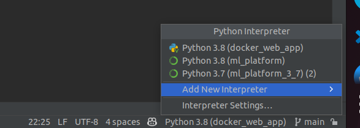
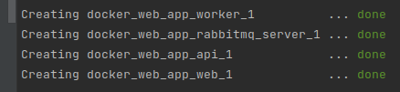
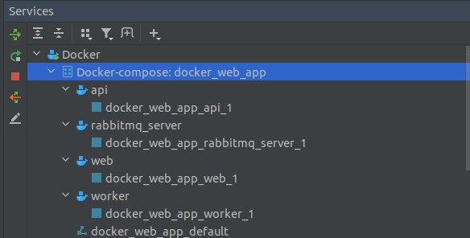
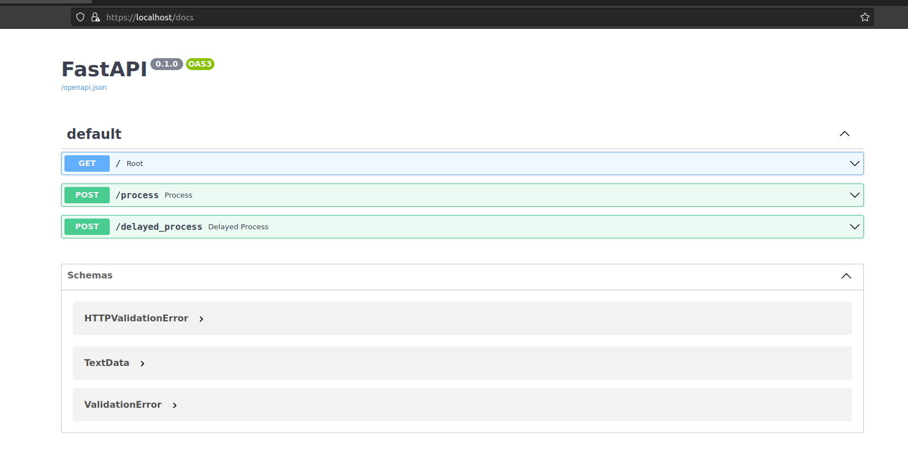

# Dockerized NLP Web App with SpaCy, FastAPI and Nginx

Skeleton set of files to provide a web app with HTTP and HTTPS.

The app is based on FastAPI (but it is easy to substitute a Flask app). 

The web app is constructed using Docker Compose. Nginx is used as reverse proxy. It also uses celery as a backend task queue.

The web app is built to support ML processing on a GPU. There is a later option to have a separate celery instance 
for GPU-enabled ML inference.

---
## Preparation
I like to use a virtual environment for local development and testing.

PyCharm sometimes has issues creating a virtual environment so do set this from the command line.
```commandline
python -m venv venv
```
Then add within Pycharm as an existing local interpreter for development.


---
### Local Environment vs Docker Environment
One thing to get your head around in a Docker implementation is that there are multiple environments 
where you code runs. The Docker containers that are generated via docker-compose are one environment.
The local environment as stored within the `venv` folder is another. 

The local environment is used for development and testing. The Docker environment is used for deployment.

Hence, there are two `requirements.txt` files. One for the local environment and one for the Docker environment.
The `requirements_for_local_venv.txt` file is used to create the local environment. 
The `requirements_for_docker.txt` file is used for the Docker build.

### HTTPS and SSL Certificates
For this demo, we will use a self-signed certificate. The `nginx.conf` expects the certificate 
to be in the `\etc\ssl\certs` directory (within the nginx container). 

In the `docker-compose.yml` file,
the `nginx` service is configured to mount a directory from the host machine and make this 
available to the container as `\etc\ssl\certs`. The absolute path to the directory on the host machine
is set as the SSL_PATH variable in the `.env` file.

For production, you will need to obtain a certificate from a certificate authority (CA). 
The best way to do this is to use a tool like `certbot` to obtain a certificate from Let's Encrypt.

For local development you can use a self-signed certificate. To generate this run the 
following command:
```commandline
sudo openssl req -x509 -newkey rsa:4096 -keyout /etc/ssl/certs/privkey.pem -out /etc/ssl/certs/fullchain.pem -sha256 -days 365 -nodes
```
(`sudo` to write to `etc/ssl/certs` - feel free to drop the sudo if the path is to a /home directory).

---
## Building the App
I use PyCharm to help coordinate Docker using the Docker plugin. 
You can directly run from the IDE window by clicking the little play symbol in the margin in the
`docker-compose.yml` file. To build and run via the command line use:
```commandline
docker-compose --build -f /home/ben/Projects/docker_web_app/docker-compose.yml up -d
```
This generates four containers and three Docker images:


In PyCharm you can manage these quite nicely using the `Services` window.


Once the containers are running, you can access the web app via the browser at `https://localhost`.
You will get a warning about the self-signed certificate. This is expected. Just accept.

Explore the API using the Swagger UI at `https://localhost/docs`.


---
## Todo
- [ ] Add support for gunicorn as webserver with uvicorn worker
- [ ] Add support for separate celery instance for GPU-enabled ML inference
- [ ] Add database backend (e.g. Postgres) and ORM (e.g. SQLAlchemy)
- [ ] Add support for authentication (e.g. using fastapi-users)
- [ ] Add error message if posting to http - only allow posting to https